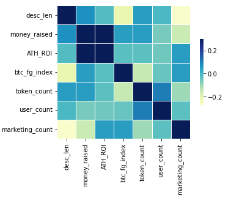
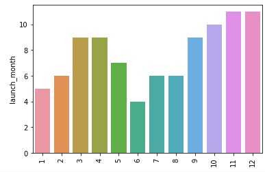
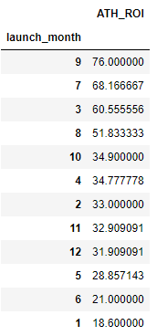
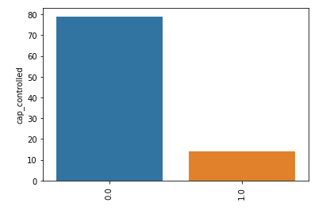
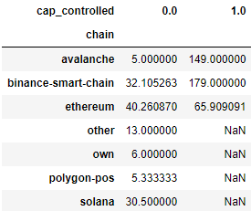
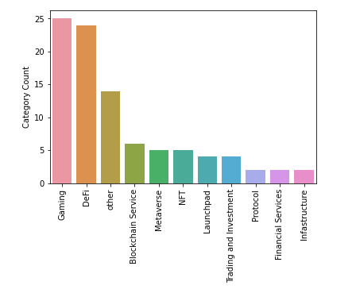
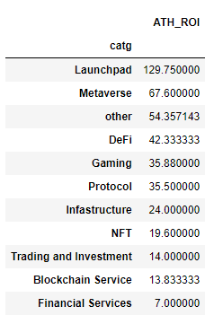

# Data Science Return on Investment from DAO Maker launches Predictor
# Project Overview
* Created a model that estimates Return Of Investment of the digital currencies projects that were launched on [DAO Maker](https://daomaker.com/) to help investors with their financial decisions. 
* 'Mean Absolute Error' to be ~28x (Range of expected values to be 1x-352x)
* Scraped all publicly launched projects from [DAO Maker](https://daomaker.com/) using **Beautiful Soup** and [Coingecko](https://www.coingecko.com/) API.
* Engineered features from the text of each project's description to find its importance when it comes to the success of the project.
* Optimized **Lasso, Random Forest, and Support Vector Regressors** using GridsearchCV to reach the best model.
* Built a client facing API using Flask

# Code and Resources Used
* **Python Version:** 3.9
* **Packages:** pandas, numpy, sklearn, matplotlib, seaborn, nltk, BeautifulSoup, flask, json, pickle, pycoingecko, wordcloud
* **For Web Framework Requirements:** ```pip install -r requirements.txt```
* **Flask Productionization:** https://towardsdatascience.com/productionize-a-machine-learning-model-with-flask-and-heroku-8201260503d2

## Web Scraping
Gathered 93 samples with features. With each project, we got the following:
*   Project's name
*   All Time High Return on Investment
*   Money raised
*   Project's category
*   Venture Capital backing the project
*   Market Maker backing the project
*   Whether the capitalization is controlled
*   Whether the project is approved by DAO
*   Timestamp of the date of public launch
*   Chain project started on
*   Project's description

## Data Cleaning
After scraping the data, it needed to be cleaned up and engineered, so that it was usable for machine learning process. The following changes were made: 
*   Parsed numeric data out of Money Raised and ROI
*   Filled NaN values properly
*   Column for description length
*   Tokenized, stemmed and counted commonly appearing words I thought could be interesting to explore
*   Calculated ratio - word frequency / description's length
*   Simplified the date into DD/MM/YY from Timestamp
*   Created column with Bitcoin Fear&Greed Index value on the day of the launch
*   Made column with just the month of the public launch
*   Grouped least appearing VCs and MMs as 'other'

## Exploratory Data Analysis
Found some insights by visualizing data with **seaborn** and **matplotlib**. The other useful way to analyze data was through pivot tables.

**Correlation of numerical data.**
* There is relatively significant correlation between raised money and All time high ROI
* We can also see that the number of appearences of word 'marketing' have some importance in respect of Return On Investment.
* I find it interesting that there's actually negative correlation between Bitcoin's Fear and Greed index and ROI.


**Month of the public launch**
* Looks like the 4th quarter is the busiest with the launches
* However, 3rd quarter looks the most successful by looking at Average Return of Investment
&nbsp;&nbsp;&nbsp;&nbsp;

**Controlled Capitalization significance**
* By looking at the Count Chart it is notable that very most of projects do not have controlled capitalization
* Also, by looking at the pivot table the positive value of this category is limited to three most popular chains.
* Furthermore, projects with controlled cap tend to give significantly better ROI.

&nbsp;&nbsp;&nbsp;&nbsp;

**Project's Category**
* DeFi and Gaming have huge dominance with its frequency
* However, it seems like Launchpads and Metaverse projects tend to outperform. 
* But it is important to notice that it is average value - one huge ROI can make notable difference
&nbsp;&nbsp;&nbsp;&nbsp;

## Model Building
The first step was to transfrom the categorical data into dummy variables. Then the data was split into train and test sets with test size of 20%.

Three different algorithms were used for the project. The evaluation technique is Mean Absolute Error as it is pretty easy to interpret with regressors.

Models:
* **Lasso Regression** - Baseline for the model.
* **Random Forest** - the algorithm works fairly good with high-dimensional data. As the data was mostly categorical it turns out to be a good fit.
* **Support Vector Regression** - the dataset size is pretty low, so we are free to use this algorithm.

## Model Performance
The Support Vector Regression outperformed Random Forest a bit, and sigificantly the Lasso Regression on the test and validation sets
* SVR: 28.68643334761664
* Random Forest: 33.794736842105266
* Lasso Regression: 58.126310261556156

## Productionization
In this step, the flask API endpoint that is hosted on a local webserver by following along with the TDS tutorial in the reference section above. The API endpoint takes in a request with a list of values from a input and returns an estimated ROI.

